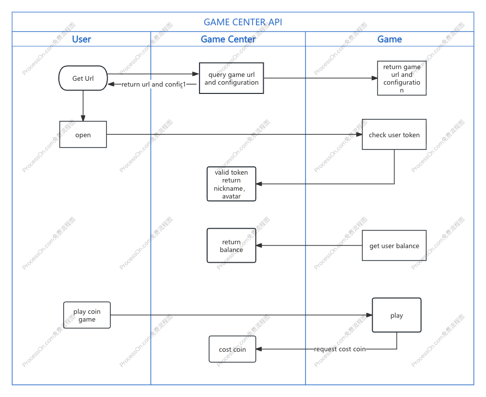

# Game Center Integration Guide

**Target Audience:** Client developers, Server developers, QA  
**Last Updated:** 2026-05-29  
**Document Version:** V1.1.0

---

## 1. Introduction

This document describes the integration between the game side and Game Center (GC) via standardized APIs. Main features include:

- Get game URL
- Login & authentication
- Get user info and balance
- Deduct / credit points
- Game record query

## 2. Interaction Sequence Diagram



## 3. Integration Flow Overview

1. **Get game URL:** Game Center requests the game URL from the game server using the game id and user login token.
2. **Open game & verify:** The user opens the game via the URL; the game server must call Game Center to validate the user token and obtain username and avatar.
3. **Get balance:** The game server requests the user balance from Game Center.
4. **Credit operations:** When the user plays for points, the game server sends deduct/credit requests to Game Center.
5. **Exit game:** When the user exits the game, the game server sends an exit request to Game Center.

---

## 4. Game Center API (Public Category)

### 4.1 User Token Validation

- **Method:** `POST`
- **Path:** `/game-proxy/user/token/check`

**Request Headers**

| Parameter | Description |
|-----------|-------------|
| token     | 70d79fa3-e2f4-46ae-9b28-bbee4cd795b3 (Token secret: game-proxy-10086) |

**Request Body**

```json
{
  "jsonrpc": "2.0",
  "id": "req-001",
  "method": "user.session.check",
  "params": {
    "token": "sdfsdfsdfsdfss"  // User token from frontend
  }
}
```

**Response Body**

```json
{
  "jsonrpc": "2.0",
  "id": "req-001",
  "method": "user.session.check",
  "result": {
    "a0": 100841,  // Root agent
    "userId": 100821,  // User ID
    "avatar": "https:// pbtest.buyacard.cc/img/user/avatar/a.png",  // Avatar
    "nickname": "",  // Nickname
    "gender": 1  // Gender: 0 Unknown, 1 Male, 2 Female
  },
  "error": null
}
```

(gender: 0 Unknown / 1 Male / 2 Female)

---

### 4.2 User Score Change

- **Method:** `POST`
- **Path:** `/game-proxy/user/score/change`

**Request Headers**

| Parameter | Description |
|-----------|-------------|
| token     | 70d79fa3-e2f4-46ae-9b28-bbee4cd795b3 |

**Request Body**

```json
{
  "jsonrpc": "2.0",
  "id": "req-001",
  "method": "user.score.change",
  "params": {
    "a0": 1008171,  // Root agent
    "userId": 1019818,  // User ID
    "category": "0",  // Game category ID
    "providerId": "1",  // Game provider ID
    "gameId": "181818",  // Game ID
    "score": 999.00,  // Score/points
    "transactionId": "23424324324",  // Transaction ID
    "opType": "debit",  // debit / credit / return (cancel-refund) / gift
    "currency": "GOLD"  // Currency: GOLD=free, VND/USD=real money
  }
}
```

(opType: debit / credit / return for cancel-refund / gift for direct bonus credit. `gift` is mapped to internal opType `3`; `score` must be greater than 0.)

**Response Body**

```json
{
  "jsonrpc": "2.0",
  "id": "req-001",
  "method": "user.score.change",
  "result": {
    "a0": 100841,
    "userId": 100821,  // User ID
    "currency": "GOLD",  // Currency
    "score": "100.00"  // Amount
  },
  "error": null
}
```

---

### 4.3 User Exit

- **Method:** `POST`
- **Path:** `/game-proxy/user/game/exit`

**Request Headers**

| Parameter | Description |
|-----------|-------------|
| token     | 70d79fa3-e2f4-46ae-9b28-bbee4cd795b3 |

**Request Body**

```json
{
  "jsonrpc": "2.0",
  "id": "req-001",
  "method": "user.exit",
  "params": {
    "a0": 1008171,  // Root agent
    "userId": 1019818,  // User ID
    "category": "0",  // Game category ID
    "providerId": "1",  // Provider ID
    "gameId": "181818"  // Game ID
  }
}
```

**Response Body**

```json
{
  "jsonrpc": "2.0",
  "id": "req-001",
  "method": "user.exit",
  "result": true,
  "error": null
}
```

---

### 4.4 Get User Balance

- **Method:** `POST`
- **Path:** `/game-proxy/user/balance`

**Request Headers**

| Parameter | Description |
|-----------|-------------|
| token     | jwt |

**Request Body**

```json
{
  "jsonrpc": "2.0",
  "id": "req-001",
  "method": "user.balance",
  "params": {
    "a0": "1111111",  // Root agent
    "userId": 123123,  // User ID
    "currency": "GOLD",  // Currency: GOLD=free, VND/USD=real money
    "gameInfo": {} // gameInfo object
  }
}
```

**Response Body**

```json
{
  "jsonrpc": "2.0",
  "id": "req-001",
  "method": "user.balance",
  "result": {
    "a0": 100841,  // Root agent
    "userId": 100821,  // User ID
    "currency": "GOLD",  // Currency: GOLD=free, VND/USD=real money
    "score": "100.00"  // Amount
  },
  "error": null
}
```

---

### 4.5 Recent User Game Win/Loss Statistics

- **Method:** `POST`
- **Path:** `/oapi/game-order-collection/getUserRecentGameWinLossStat`

Returns the last 5 games played by a user from `game_order_collection`, then groups each game's settled records into win and lose buckets. Each bucket includes the net payout difference for the last 15 minutes and last 24 hours.

**Calculation Rules**

| Field | Rule |
|-------|------|
| Last played games | Top 5 distinct `game_id` ordered by `MAX(bet_time)` desc |
| Win bucket | `order_status = 1` |
| Lose bucket | `order_status = 3` |
| Time windows | Based on `bet_time`, relative to request processing time |
| Difference amount | `settle_score - bet_score`; converted by the A0 currency unit before summing |

**Request Body**

```json
{
  "a0": 11012184,
  "userId": 11011234
}
```

`kolUserId` can be used instead of `a0`. `userid` and `user_id` are also accepted as aliases for `userId`.

**Response Body**

```json
{
  "success": true,
  "errCode": "0",
  "errMessage": "success",
  "data": {
    "games": [
      {
        "gameId": 1497254068404215812,
        "lastBetTime": "2026-05-27T17:30:57",
        "win": {
          "last15MinutesDiffAmount": 110.53100000,
          "last24HoursDiffAmount": 322.78800000
        },
        "lose": {
          "last15MinutesDiffAmount": -2.47100000,
          "last24HoursDiffAmount": -9.30400000
        }
      }
    ]
  }
}
```

If a game has no settled win or lose records in a window, the corresponding amount is `0`.

---

## 5. Game-Side APIs

The following APIs are implemented and exposed by the game side for Game Center to call.

### 5.1 Query Game Statistics Interface

- **Method:** `POST`
- **Path:** `/game-proxy/game/order/stat`

**Request Body**

```json
{
  "jsonrpc": "2.0",
  "id": "req-001",
  "method": "game.order.stat",
  "params": {
    "a0": 19191,  // Root agent, required
    "userIds": [199817, 12123],  // User IDs, optional
    "currency": "GOLD",  // Currency, required
    "isSettle": 0,  // Is settled: 0=No 1=Yes, optional
    "state": [],  // State 0,1,2,3,4,5,7, optional
    "gameInfo": {
        "category": "0",  // Game category ID, optional
        "providerId": "1",  // Game provider ID, required
        "gameId": "101891"  // Game ID, optional
    },
    "groupId": "DEF",  // groupId, default DEF, optional
    "beginTime": "YYYY-MM-DD HH:mm:ss",  // Start time, required
    "endTime": "YYYY-MM-DD HH:mm:ss",  // End time, required
    "timezone": 0,  // 0=Singapore 1=US Eastern, required
    "page": 1,
    "size": 100,
    "hasStat": 0  // Need total: 0=No 1=Yes, required
  }
}
```

**Response Body**

```json
{
  "jsonrpc": "2.0",
  "id": "req-001",
  "result": {
    "total": 100,  // Total count
    "totalBetScore": 0,  // Total bet amount
    "totalSettleScore": 0,  // Total settle amount
    "totalValidScore": 0,  // Total valid bet amount
    "list": [
      {
        "gameId": "1",  // Game ID
        "groupId": "1",  // Room/group ID
        "currency": "RMB",  // Currency
        "betScore": 100.0,  // Bet amount
        "settleScore": 100.0,  // Payout amount
        "validScore": 100.0,  // Valid bet
        "userId": 100211  // User ID
      }
    ]
  },
  "error": null
}
```

---

### 5.2 Query Game Order Interface

- **Method:** `POST`
- **Path:** `/game-proxy/game/order/query`

**Request Headers**

| Parameter | Description |
|-----------|-------------|
| token     | 70d79fa3-e2f4-46ae-9b28-bbee4cd795b3 |

**Request Body**

```json
{
  "jsonrpc": "2.0",
  "id": "req-001",
  "method": "game.order.query",
  "params": {
    "orderId": "1213123213",  // Order ID, optional
    "a0": 19191,  // Root node ID, required
    "userId": 199817,  // User ID, optional
    "currency": "GOLD",  // Currency, required
    "state": [0],  // State: 0 Unsettled, 1 Win, 2 Draw, 3 Loss, 4 User Cancelled, 5 System Cancelled, 7 Abnormal, optional
    "gameInfo": {
        "category": "0",  // Game category ID, optional
        "providerId": "1",  // Game provider ID, required
        "gameId": "101891"  // Game ID, optional
    },
    "returnGameInfo": 0,  // Return order detail: 0=No 1=Yes, required
    "groupId": "sdfs",  // groupId, default DEF, optional
    "beginTime": "YYYY-MM-DD HH:mm:ss",  // Start time, required
    "endTime": "YYYY-MM-DD HH:mm:ss",  // End time, required
    "timeZone": 0,  // 0=Singapore 1=US Eastern, required
    "page": 1,
    "size": 100,
    "hasStat": 0  // Need total: 0=No 1=Yes, required
  }
}
```

**Response Body**

```json
{
  "jsonrpc": "2.0",
  "id": "req-001",
  "result": {
    "total": 100,  // Total count
    "totalBetScore": 0,  // Total bet amount
    "totalSettleScore": 0,  // Total settle amount
    "totalValidScore": 0,  // Total valid bet amount
    "list": [
      {
        "a0": "12313",
        "userId": "324324",  // User ID
        "gameId": "1",  // Game ID
        "orderId": "2342342",  // Order ID
        "currency": "GOLD",  // Currency
        "betTime": "YYYY-MM-DD HH:mm:ss",  // Bet time
        "state": 1,  // State: 0 Unsettled, 1 Win, 2 Draw, 3 Loss, 4 User Cancelled, 5 System Cancelled, 7 Abnormal
        "betScore": 100.0,  // Bet amount
        "settleScore": 100.0,  // Payout amount
        "validScore": 100.0,  // Valid bet
        "settleTime": "YYYY-MM-DD HH:mm:ss",  // Settle time
        "groupId": "2322",  // Group ID
        "isSettle": 0,  // Is settled: 0=No 1=Yes (state 1,2,3)
        "gameInfo": {}
      }
    ]
  },
  "error": null
}
```

(state: 0 Unsettled / 1 Win / 2 Draw / 3 Loss / 4 User Cancelled / 5 System Cancelled / 7 Abnormal)

---

### 5.3 Query Order Detail Interface

- **Method:** `POST`
- **Path:** `/game-proxy/game/order/detail`

**Request Headers**

| Parameter | Description |
|-----------|-------------|
| token     | 70d79fa3-e2f4-46ae-9b28-bbee4cd795b3 |

**Request Body**

```json
{
  "jsonrpc": "2.0",
  "id": "req-001",
  "method": "game.order.detail",
  "params": {
    "orderId": "1213123213",
    "language": "CN",
    "currency": "CNY",
    "gameInfo": { "category": "0", "providerId": "1", "gameId": "101891" }
  }
}
```

**Response Body**

```json
{
  "jsonrpc": "2.0",
  "id": "req-001",
  "result": "https://sfdsfd.com",
  "error": null
}
```

---

### 5.4 Get Game URL

- **Method:** `POST`
- **Path:** `/game-proxy/game/url`

**Request Headers**

| Parameter    | Description |
|--------------|-------------|
| Content-Type | application/json |
| token        | 70d79fa3-e2f4-46ae-9b28-bbee4cd795b3 (See: https://pb-api-doc.pwtk.cc/project/253/wiki) |

**Request Body**

```json
{
  "jsonrpc": "2.0",
  "id": "req-001",
  "method": "game.url",
  "params": {
    "token": "sdfdsfdsfsd",  // User token, required
    "device": "PC",  // Terminal, required: PC, H5
    "language": "zh-CN",  // Language, required
    "currency": "GOLD",  // Currency, required
    "groupId": "1000",  // Group ID, default DEF, optional; required when isGroupTrace=1
    "isGroupTrace": 0,  // 0=No tracking (default), 1=Tracking (must set groupId)
    "isDemo": 0,  // Is demo: 0=No 1=Yes, required
    "limitConfigId": co2, // 现红配置，no required
    "ext":  { }, // 透传参数，no required
    "gameInfo": {
        "category": "0",  // Game category ID, required
        "providerId": "1494326540744264616",  // 1494326540744264616 is h5games，Game provider ID, required
        "gameId": "101891"  // Game ID, optional; 6 games: 1503790445774242709 carnival, 1503780287216092019 foddie, 1503779730992661356 royal, 1499486369695664870 tanmin, 1499484616333986513 farm, 1494327065715936934 转盘
    },
    "returnUrl": ""  // Return URL, optional
  }
}
```

**Response Body**

```json
{
  "jsonrpc": "2.0",
  "id": "req-001",
  "result": {
    "url": "https://www.ddf.com",  // Game entry URL
    "config": {}
  },
  "error": null
}
```

---

### 5.5 Order Collection Interface

- **Method:** `POST`
- **Path:** `/game-proxy/game/order/collect`

**Request Headers**

| Parameter    | Description         |
|--------------|---------------------|
| Content-Type | application/json    |

**Request Body**

Request format is JSON-RPC. Example:

```json
{
  "jsonrpc": "2.0",
  "id": "req-001",
  "method": "game.order.collect",
  "params": {
    "startTime": "YYYY-MM-DD HH:mm:ss",
    "endTime": "YYYY-MM-DD HH:mm:ss",
    "pageNum": 1,
    "pageSize": 100,
    "providerId": "1",
    "categoryId": "0",
    "gameId": "101891",
    "timeZone": 0
  }
}
```

| Parameter   | Type   | Description                              |
|-------------|--------|------------------------------------------|
| startTime   | string | Start time                               |
| endTime     | string | End time                                 |
| pageNum     | number | Page number                              |
| pageSize    | number | Page size                                |
| providerId  | string | Game provider ID (optional)              |
| categoryId  | string | Game category ID (optional)              |
| gameId      | string | Game ID (optional)                       |
| timeZone    | number | Timezone: 0 Beijing Time / 1 US Eastern  |

**Response Body**

Returns paginated data. Example:

```json
{
  "jsonrpc": "2.0",
  "id": "req-001",
  "result": {
    "total": 100,
    "list": [
      {
        "a0": "string",
        "userId": "string",
        "providerId": "string",
        "categoryId": "string",
        "gameId": "string",
        "groupId": "string",
        "orderId": "string",
        "betScore": "string",
        "effectScore": "string",
        "settleScore": "string",
        "status": "string",
        "betTime": "string",
        "settleTime": "string",
        "gameInfo": "string",
        "currency": "string"
      }
    ]
  },
  "error": null
}
```

| Field        | Description    |
|--------------|----------------|
| total        | Total count    |
| list         | Order list     |
| betScore     | Bet amount     |
| effectScore  | Valid bet      |
| settleScore  | Settle amount  |
| status       | Order status   |

---

### 5.6 Exit Game

- **Method:** `POST`
- **Path:** `/game-proxy/game/exit`

**Request Headers**

| Parameter | Description |
|-----------|-------------|
| token     | 70d79fa3-e2f4-46ae-9b28-bbee4cd795b3 |

**Request Body**

```json
{
  "jsonrpc": "2.0",
  "id": "req-001",
  "method": "game.user.exit",
  "params": {
    "a0": 19191,
    "userId": 199817,
    "device": "PC",
    "language": "CN",
    "currency": "RNB",
    "groupId": "were",
    "gameInfo": { "category": "0", "providerId": "1", "gameId": "101891" }
  }
}
```

**Response Body**

```json
{
  "jsonrpc": "2.0",
  "id": "req-001",
  "result": true,
  "error": null
}
```

---

## 6. Request Authentication: JWT Token

API requests must carry a JWT Token in the request header for authentication. The caller must add a `token` field in **Request Headers** with a valid JWT Token. The server will verify the token; only valid tokens are allowed to access the APIs.

### Token Generation Demo

```java
public String getToken() {
    Map<String, String> map = new HashMap<>(2);
    map.put("service", "game-center");
    map.put("exp", System.currentTimeMillis() + 24 * 3600 * 1000L + "");
    // map.put("iat", System.currentTimeMillis() + "");
    return JWTUtil.generateToken(key, System.currentTimeMillis() + 24 * 3600 * 1000L, map);
}
```
